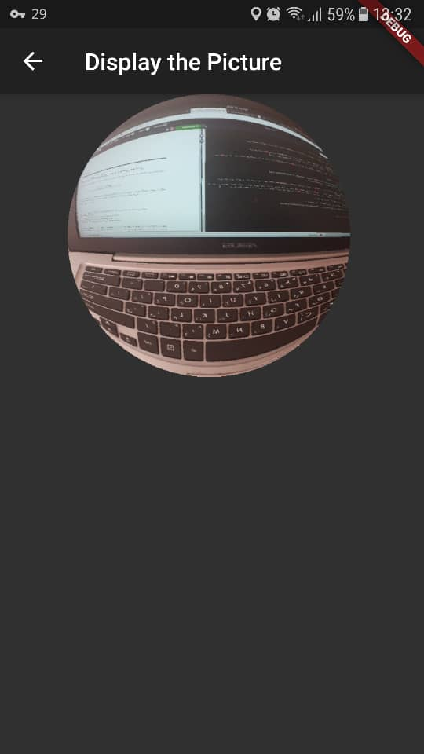

# Fisheye

A [Flutter](https://flutter.dev/) application that applies the [fisheye](https://en.wikipedia.org/wiki/Fisheye_lens) transformation to an image captured by an android phone's camera. 

## Sample run

A full report is available in the `doc/` directory. 
